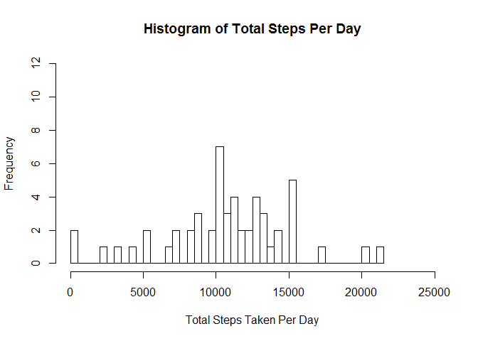
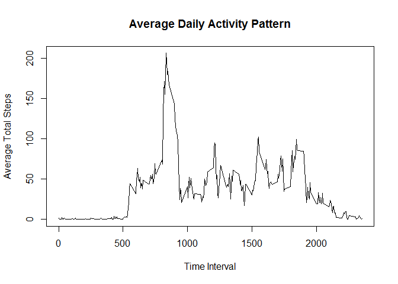
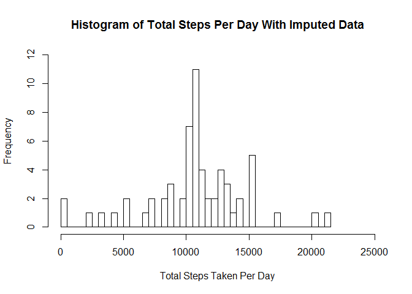

# Reproducible Research: Peer Assessment 1

## Loading and preprocessing the data

```r
activityMonitoringData <- read.csv(file = "activity.csv", 
                                   na.strings = c("NA"), 
                                   colClasses = c(steps="numeric", date="Date", interval="integer"))
```

## What is mean total number of steps taken per day?

```r
totalStepsPerDay <- aggregate(x = activityMonitoringData$steps,
                              by = list(activityMonitoringData$date),
                              FUN = sum)
names(totalStepsPerDay) = c("date", "steps")
```

Here is a histogram of the total number of steps taken each day ignoring NAs:

```r
hist(totalStepsPerDay$steps, 
     breaks = 50,
     xlim = c(0, 25000),
     ylim = c(0, 12),
     main = "Histogram of Total Steps Per Day", 
     xlab = "Total Steps Taken Per Day")
```

\

## What is mean total number of steps taken per day?

```r
meanStepsPerDay <- mean(totalStepsPerDay$steps, na.rm = TRUE)
medianStepsPerDay <- median(totalStepsPerDay$steps, na.rm = TRUE)
```

Mean of the total number of steps taken per day: 10,766.2

Median of the total number of steps taken per day: 10,765.0


## What is the average daily activity pattern?

```r
avgStepsPerTimeInterval <- aggregate(x = activityMonitoringData$steps,
                                     by = list(activityMonitoringData$interval),
                                     FUN = "mean",
                                     na.rm = TRUE)
names(avgStepsPerTimeInterval) = c("interval", "avgSteps")

plot(avgStepsPerTimeInterval$interval,
     avgStepsPerTimeInterval$avgSteps,
     type = "l",
     main = "Average Daily Activity Pattern",
     xlab = "Time Interval",
     ylab = "Average Total Steps")
```

\

```r
maxInterval <- as.character(avgStepsPerTimeInterval[which.max(avgStepsPerTimeInterval$avgSteps), "interval"])
```

5-minute interval which contains the maximum number of steps: 835

## Imputing missing values
Total number of missing values in the dataset: 2,304

#### Replace all of the NA values with the average value for that particular 5-minute interval

```r
#### Create and fill a data.frame for all days with average data 
everyDayAverageData <- activityMonitoringData
everyDayAverageData$steps <- avgStepsPerTimeInterval$avgSteps

#### Substitute the average values into a new imputed data.frame
imputedActivityMonitoringData <- activityMonitoringData
imputedActivityMonitoringData$steps <- ifelse(is.na(imputedActivityMonitoringData$steps),
                                              everyDayAverageData$steps,
                                              imputedActivityMonitoringData$steps)

#### Now work with the imputed data
imputedTotalStepsPerDay <- aggregate(x = imputedActivityMonitoringData$steps,
                              by = list(imputedActivityMonitoringData$date),
                              FUN = sum)
names(imputedTotalStepsPerDay) = c("date", "steps")
```

Total number of missing values in the imputed dataset: 0
Here is a histogram of the total number of steps taken each day including imputed data:

```r
hist(imputedTotalStepsPerDay$steps, 
     breaks = 50,
     xlim = c(0, 25000),
     ylim = c(0, 12),
     main = "Histogram of Total Steps Per Day With Imputed Data", 
     xlab = "Total Steps Taken Per Day")
```

\

```r
imputedMeanStepsPerDay <- mean(imputedTotalStepsPerDay$steps, na.rm = TRUE)
imputedMedianStepsPerDay <- median(imputedTotalStepsPerDay$steps, na.rm = TRUE)
```

Mean of the total number of steps taken per day (with imputed data): 10,766.2

Median of the total number of steps taken per day (with imputed data): 10,766.2

Do these values differ from the estimates from the first part of the assignment? 
  - The mean is the same, but the median is slightly different.

What is the impact of imputing missing data on the estimates of the total daily number of steps?
  - The mean doesn't change since you are only adding in average values, but the daily totals will increase.

## Are there differences in activity patterns between weekdays and weekends?

```r
imputedActivityMonitoringData$weekDay <- factor(weekdays(imputedActivityMonitoringData$date))
imputedActivityMonitoringData$weekPart <- factor(ifelse(imputedActivityMonitoringData$weekDay == "Saturday" |
                                                             imputedActivityMonitoringData$weekDay == "Sunday",
                                                        "weekend",
                                                        "weekday"))

avgStepsPerIntervalWeekPart <- aggregate(x=imputedActivityMonitoringData$steps,
                                        by = list(imputedActivityMonitoringData$interval, imputedActivityMonitoringData$weekPart),
                                        FUN = "mean",
                                        na.rm = TRUE)
names(avgStepsPerIntervalWeekPart) = c("interval", "weekpart", "avgSteps")

library(lattice,)
```

```
## Warning: package 'lattice' was built under R version 3.2.3
```

```r
xyplot(avgSteps ~ interval | weekpart, 
       data = avgStepsPerIntervalWeekPart, 
       type = "l",
       xlab = "Interval",
       ylab = "Number of steps",
       layout = c(1, 2))
```

\
